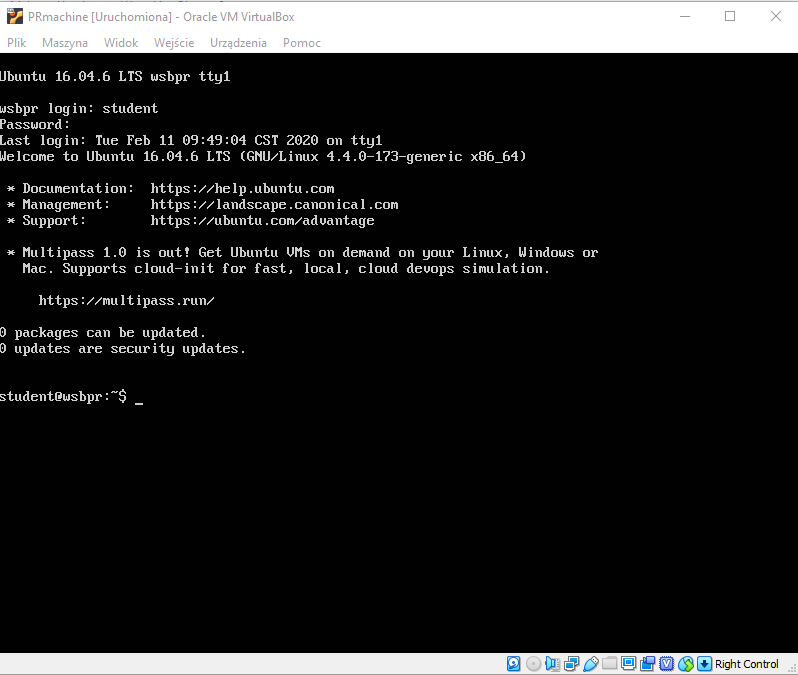

# Maszyna wirtualna
Laborka numer 3 opiera się głównie o użycie tej maszyny wirtualnej.
Maszyna może być również bardzo przydana w laborce drugiej i czwartej.

### Pobranie dysku maszyny
Maszynę należy sobie stworzyć od zera, potem jedynie podepniemy do niej dysk twardy przygotowany przez prowadzącego.
Dysk twardy (plik VHD) zajmuje trochę ponad 5GB. Proszę zauważyć, że pobranie tak dużego pliku przez kilkanaście osób na laboratorium prawdopodobnie będzie niemożliwe. Dlatego należy przygotować się wcześniej i przynieść obraz maszyny wirtualnej na przykład na pendrive.

Aby pobrać dysk maszyny wirtualnej kliknij [tutaj](https://drive.google.com/file/d/1rXKcHMqjjE3AOLNOm7c7FSZqcGCezzHk/view?usp=sharing).

### Utworzenie nowej maszyny i podpięcie dysku
Gdy dysk twardy został pobrany i zapisany w dogodnej lokalizacji można przystąpić do stworzenia maszyny wirtualnej.
Całość zademonstrowana będzie na przykładzie 'wirtualizatora' Oracle VM VirtualBox. Dostępny on jest również na komputerach laboratoryjnych na uczelni. Jeśli na swoim komputerze 'domowym' nie masz jeszcze zainstalowanego VirtualBoxa, możesz go pobrać [stąd](https://www.virtualbox.org/wiki/Downloads).

#### Konfiguracja sieci izolowanej VirtualBox'a
Na samym początku upewnij się, że na liście sieci izolowanych 'host only' znajdzie się przynajmniej jedna z włączonym klientem DHCP. Jeśli takiej brak to należy ją dodać. Przykładowe parametry na screenie (menu Tools -> Network):

Sieć ta, pozwoli nam na dostęp z komputera hosta na komputer gościa.

#### Dodanie maszyny:
Przeklikaj swoją maszynę podobnie jak na poniższych screenach:
- Maszyna -> Nowa


- Im więcej pamięci tym lepiej, ale trzeba pamiętać, że host też potrzebuje co nieco. Dobrym ustawieniem może być po prostu połowa dostępnej pamięci RAM. Przy 16GB, wartością będzie 8192MB (4GB).

- W kolejnym oknie wybieramy użycie istniejącego już dysku (pobrany wcześniej plik):

Po dodaniu dysku i kliknięciu w przycisk 'Utwórz' maszyna zostanie stworzona. Jednak przed uruchomieniem musimy ustawić jeszcze kilka rzeczy (PPM -> Ustawienia):
- Przekaż maszynie wirtualnej jak najwięcej rdzeni. Zasada podzielności przez 2 (jak przy pamięci), również wydaje się tutaj bezpieczna.

- Chcemy ustawić dwa interfejsy sieciowe:
Pierwszym będzie 'NAT'. Zapewni nam połączenie z internetem.

Drugim będzie sieć 'Host Only', która pozwoli nam na łączność Host <-> Gość:


#### Uruchomienie i pierwsze logowanie
Po kliknięciu w przycisk 'Uruchom', nasza maszyna wirtualna uruchomi się.


Aby się zalogować należy podać dane logowania:
User: student
Password: student
Po zalogowaniu można wpisać polecenie ```ip a```. Wylistuje ono interfejsy sieciowe.


Jeśli każdy interfejs otrzymał adres IP, to wszystkie konfiguracje sieciowe wykonaliśmy poprawnie.
Nas interesuje adres IP otrzymany przez interfejs sieci izolowanej. W przypadku powyższego screena jest to 192.168.56.102. Zapamiętujemy go.

Dodatkowo można sprawdzić ilość pamięci RAM czy ilość procesorów:
- `free -h`
- `htop` - wyjście za pomocą 'q' naciśniętego z klawiatury.


#### Informacje o oprogramowaniu
- Ubuntu 16.04
- Python 3.8
- SSH, docker, minikube, kubectl, mpirun, biblioteki potrzebne do budowania i uruchamiania laborki numer 2.

### Łączność po SSH.
Okieko VirtualBoxa jest dość ograniczone i nie umożliwia np. wklejania i kopiowania. Można ten problem rozwiązać poprzez połączenie się z maszyną przez SSH. Serwer SSH nasłuchuje na domyślnym porcie - 22.
Popularnym klientem SSH dla windows jest [PuTTY](https://www.putty.org/)

Aby się połączyć należy wpisać sprawdzony wcześniej adres IP naszej maszyny.

Dane logowania to oczywiście nadal student/student.


### Wymiana plików między maszyną wirtualną:
Popularnym programem używanym w tym celu jest [WinSCP](https://winscp.net/eng/download.php):

